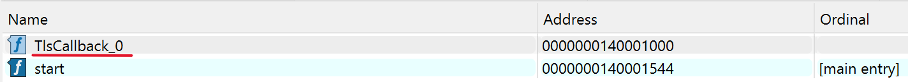
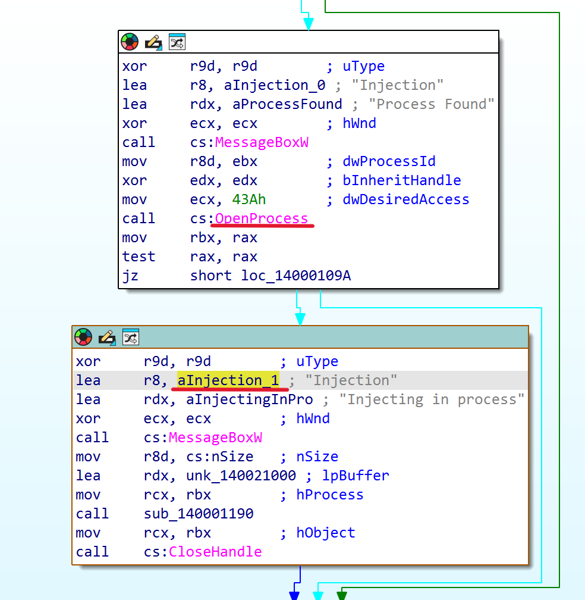
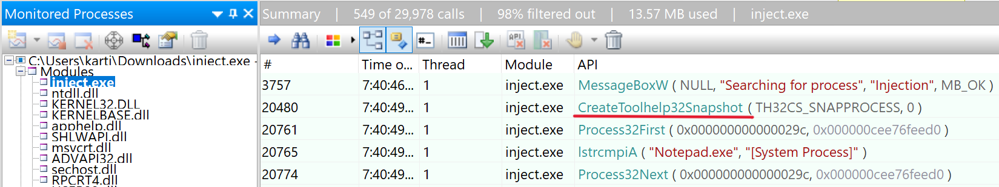
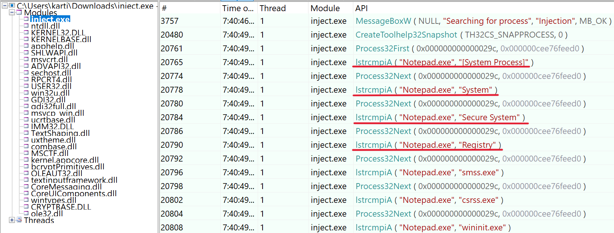
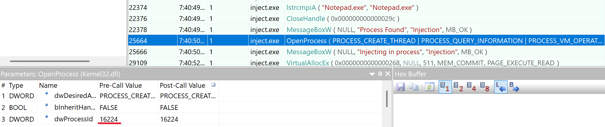
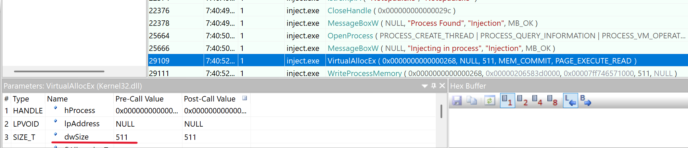
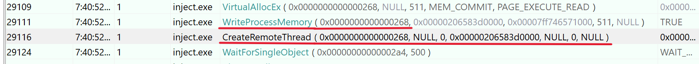
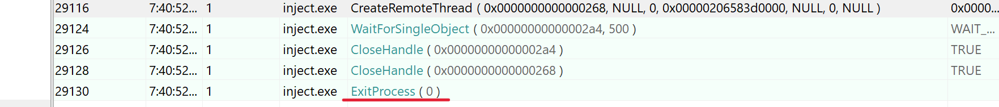
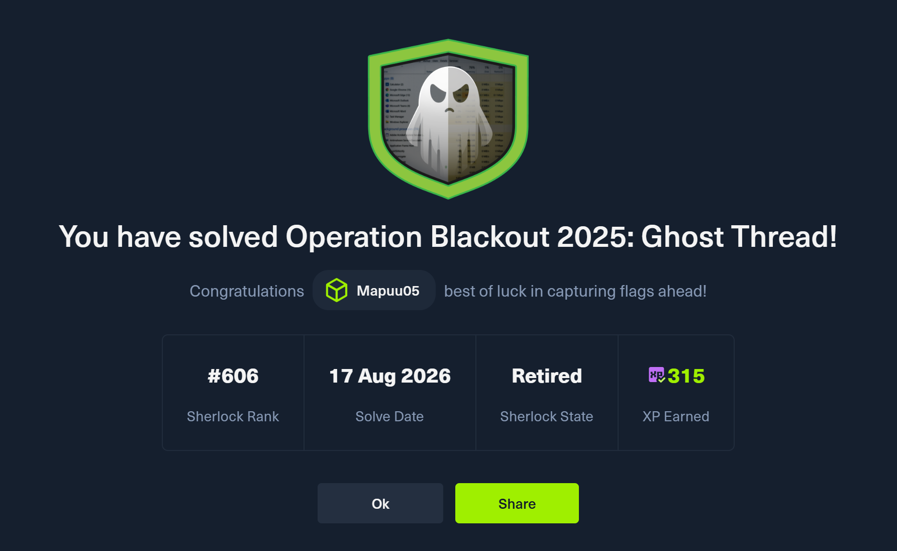

# Análisis Forense: Operation Blackout 2025 - Ghost Thread (HackTheBox)

> **Aviso:** Este informe técnico es el resultado de la resolución del escenario de simulación "Ghost Thread" (Sherlock) de la plataforma HackTheBox.

**Referencia del Caso:** Operation Blackout 2025 - Ghost Thread

**Autor:** Miguel Ángel Herrera Bastida (Mapuu05)

**Fecha de Análisis:** 17 de Agosto de 2026

**Asunto:** Análisis de artefactos de inyección de procesos y evasión de defensas (`inject.exe`)

---

## 1. Resumen Ejecutivo
El presente informe detalla el análisis técnico realizado sobre un binario sospechoso (`inject.exe`) asociado a la "Operación Blackout 2025". La investigación determinó que el artefacto malicioso emplea técnicas avanzadas de evasión, específicamente el uso de **Thread Local Storage (TLS) Callbacks**, para ejecutar código malicioso antes de que el punto de entrada principal del programa (`main()`) sea invocado. El objetivo de esta ejecución temprana es inyectar un *shellcode* en un proceso legítimo del sistema (`notepad.exe`) y posteriormente terminar su propia ejecución para no dejar rastros evidentes en memoria bajo su propio nombre de proceso.

---

## 2. Metodología de Análisis
El análisis se basó en la evidencia proporcionada, utilizando un enfoque híbrido:
1. **Análisis Estático / Ingeniería Inversa:** Inspección de la estructura del formato PE (Portable Executable) y desensamblado del código para identificar rutinas de ejecución anómalas.
2. **Análisis Dinámico (Monitorización de APIs):** Uso de la herramienta *API Monitor* para trazar las llamadas a la API de Win32 (User Mode) realizadas por el binario durante su ejecución, permitiendo reconstruir la cadena de ataque paso a paso.

---

## 3. Análisis Técnico y Hallazgos (Cadena de Ataque)

A continuación, se detalla la cadena de ataque reconstruida y la justificación técnica para cada uno de los hallazgos solicitados durante la investigación.

### Tarea 1: ¿Qué técnica de inyección de procesos utilizó el atacante?
* **Hallazgo:** Thread Local Storage (TLS) Callback.
* **Justificación Técnica:** Durante el análisis estático del binario, se inspeccionó la tabla de directorios del archivo PE. Se identificó una función registrada bajo el nombre `TlsCallback_0`. En la arquitectura de Windows, el cargador del sistema operativo (OS Loader) ejecuta estas rutinas **antes** de transferir el control al punto de entrada principal (`main`). El código ensamblador de este callback revela llamadas a APIs como `OpenProcess`, demostrando que el atacante incrustó la lógica de inyección en esta etapa temprana para evadir soluciones de seguridad.

### Tarea 2: ¿Qué API de Win32 se utilizó para tomar instantáneas de todos los procesos e hilos en el sistema?
* **Hallazgo:** `CreateToolhelp32Snapshot`
* **Justificación Técnica:** En los registros de *API Monitor*, se observa que la primera acción significativa de `inject.exe` es llamar a `CreateToolhelp32Snapshot`. Esta API es el método estándar utilizado para capturar un *"snapshot"* del estado actual del sistema, permitiendo la enumeración de procesos.

### Tarea 3: ¿Qué proceso está intentando localizar el binario del atacante para la inyección del payload?
* **Hallazgo:** `notepad.exe`
* **Justificación Técnica:** Tras crear el *snapshot*, el malware itera a través de los procesos. Los registros muestran una llamada a la función `lstrcmpiA` (comparación de cadenas). Los parámetros revelan que el malware está comparando el nombre de los procesos enumerados con la cadena estática `"Notepad.exe"`.

### Tarea 4: ¿Cuál es el ID de proceso (PID) del proceso identificado?
* **Hallazgo:** `16224`
* **Justificación Técnica:** Una vez localizado `notepad.exe`, el malware obtiene un *handle* hacia ese proceso mediante la API `OpenProcess`. Al inspeccionar el panel de parámetros en *API Monitor*, se observa claramente que el valor del parámetro `dwProcessId` es `16224`.

### Tarea 5: ¿Cuál es el tamaño del shellcode?
* **Hallazgo:** `511` bytes.
* **Justificación Técnica:** Para introducir el *payload*, el malware reserva espacio en la memoria del proceso remoto mediante `VirtualAllocEx`. Al revisar los parámetros de esta llamada, el parámetro `dwSize` tiene un valor de `511`, correspondiente al tamaño del *shellcode*.

### Tarea 6: ¿Qué API de Win32 se utilizó para ejecutar el payload inyectado en el proceso identificado?
* **Hallazgo:** `CreateRemoteThread`
* **Justificación Técnica:** Tras escribir el *shellcode* en la memoria de `notepad.exe` (usando `WriteProcessMemory`), los registros muestran una llamada a `CreateRemoteThread`. Esta API crea un nuevo hilo de ejecución dentro del proceso remoto, apuntando a la dirección de memoria donde se inyectó el código malicioso.

### Tarea 7: ¿Qué API de Win32 es responsable de terminar el programa antes de que se ejecute main()?
* **Hallazgo:** `ExitProcess`
* **Justificación Técnica:** Toda la rutina de inyección ocurre dentro del *TLS Callback*. Una vez que el hilo remoto está en ejecución, el proceso original ya no es necesario. Para evitar que el flujo continúe hacia la función `main()`, la última acción del malware es llamar a `ExitProcess`, terminando su ejecución de forma limpia.

---

## 4. Indicadores de Compromiso (IoCs) y Tácticas MITRE ATT&CK

* **Táctica:** Defense Evasion (TA0005), Privilege Escalation (TA0004).
* **Técnica Principal:** Process Injection (T1055).
* **Sub-técnica:** Thread Local Storage (T1055.005).
* **Proceso Malicioso (Origen):** `inject.exe`
* **Proceso Legítimo (Destino):** `notepad.exe` (PID: 16224)
* **Secuencia de APIs Sospechosa:** `CreateToolhelp32Snapshot` -> `Process32First/Next` -> `OpenProcess` -> `VirtualAllocEx` -> `WriteProcessMemory` -> `CreateRemoteThread` -> `ExitProcess`.

---

## 5. Conclusión
El análisis confirma que el binario `inject.exe` es un *dropper/injector* sofisticado. Al abusar de los *TLS Callbacks*, el atacante logra ejecutar la cadena completa de inyección de memoria antes de que las herramientas de análisis dinámico tradicionales puedan registrar la actividad inicial en el *Entry Point*. El *payload* final reside en la memoria de `notepad.exe`, lo que requeriría un análisis forense de memoria (Memory Forensics) sobre dicho proceso para extraer el *shellcode* y determinar el impacto final.

---
### Certificación de Resolución

---
*¿Te ha resultado útil este análisis? Conecta conmigo en [LinkedIn]() o revisa otros de mis write-ups en mi perfil de GitHub.*
